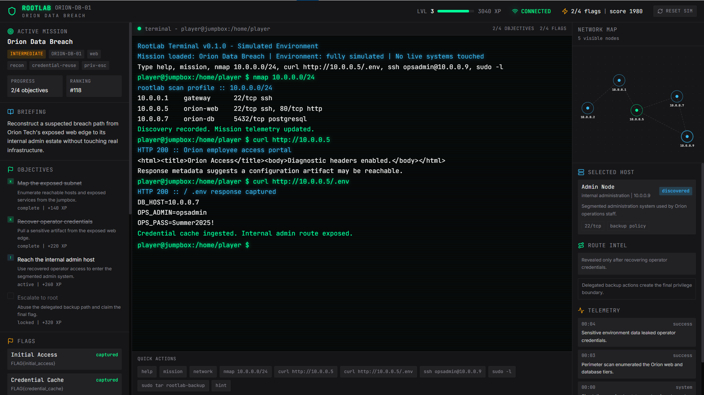

<div align="center">


<br/><br/>

[](https://dustin04x.github.io/RootLab/)
[](https://github.com/dustin04x/RootLab/actions)
[](LICENSE)
[](https://github.com/dustin04x/RootLab/stargazers)
[](https://github.com/dustin04x/RootLab/issues)

<br/>

**A browser-based cybersecurity learning simulator built around terminal-first, mission-driven offensive security training.**

*Safe. Deterministic. No live infrastructure required.*

<br/>



</div>

---

## 🎯 What is RootLab?

RootLab is an open-source platform for universities, clubs, bootcamps, and self-learners who need **realistic, replayable cyber operations scenarios** without ever touching live infrastructure. Players work through gamified missions — enumerating hosts, exploiting vulnerabilities, escalating privileges, and capturing flags — all inside a fully simulated environment interpreted by a local engine, not a real shell.

---

## ⚡ Core Goals

| Goal | Description |
|------|-------------|
| 🖥️ **Terminal-First** | Realistic hacking workflows in a safe, simulated shell |
| 🎮 **Gamified Progression** | Missions, flags, XP, badges, and global rankings |
| 🧩 **Modular Scenarios** | Official and community-authored mission content |
| 🏗️ **Production-Grade** | Architecture built for collaborative open-source development |

---

## 🚀 Quick Start

```bash
git clone https://github.com/dustin04x/RootLab.git
cd RootLab/frontend
npm install
npm run dev
```

Open **[http://localhost:3000](http://localhost:3000)** and start hacking.

---

## 📁 Repository Structure

```
RootLab/
├── frontend/               # Next.js operations interface
├── docs/
│   ├── technical-spec.md       # Full system specification
│   └── frontend-style-brief.md # UI/UX design guide
└── missions/
    └── examples/
        ├── orion-data-breach.yaml      # Example mission
        └── northbridge-relay.yaml      # Example mission
```

---

## 🛠️ Proposed Stack

<div align="center">

| Layer | Technology |
|-------|-----------|
| **Frontend** | Next.js · TypeScript · Tailwind CSS · Framer Motion · xterm.js |
| **Backend** | FastAPI · Pydantic · SQLAlchemy · WebSockets |
| **Database** | PostgreSQL |
| **Runtime** | Docker Compose · Container-first deployment |
| **Optional** | Redis (session state & pub/sub) · Object storage (assets) |

</div>

---

## 🗺️ Current Status

- ✅ `frontend/` — Working Next.js app with terminal-first demo session and deterministic local simulation state
- ✅ GitHub Pages deployment pipeline configured
- 🔧 `docs/` — Full technical specification and frontend style brief
- 📋 `missions/examples/` — Example YAML mission definitions (Orion, Northbridge)
- ❌ Backend, persistence, and engine services — specified in docs, not yet implemented

---

## 🏆 How a Mission Works

```
Choose Mission → Read Briefing → Enter Simulated Network
     ↓
Enumerate Hosts & Services → Exploit Vulnerabilities
     ↓
Escalate Privileges → Capture Flags → Complete Objectives
     ↓
Earn XP · Unlock Badges · Climb the Rankings
```

Every action is interpreted by the **simulation engine** — not a real shell. Safe, deterministic, and portable by design.

---

## 📄 Documents

- 📐 [Technical Specification](docs/technical-spec.md)
- 🎨 [Frontend Style Brief](docs/frontend-style-brief.md)
- 🧨 [Example Mission: Orion Data Breach](missions/examples/orion-data-breach.yaml)
- 🌉 [Example Mission: Northbridge Relay](missions/examples/northbridge-relay.yaml)

---

## 🤝 Contributing

Contributions are welcome — new missions, frontend features, engine work, or documentation. Open an issue to discuss or submit a pull request directly.

---

<div align="center">

Built for the security community. Open source forever.

[](https://dustin04x.github.io/RootLab/)

</div>
